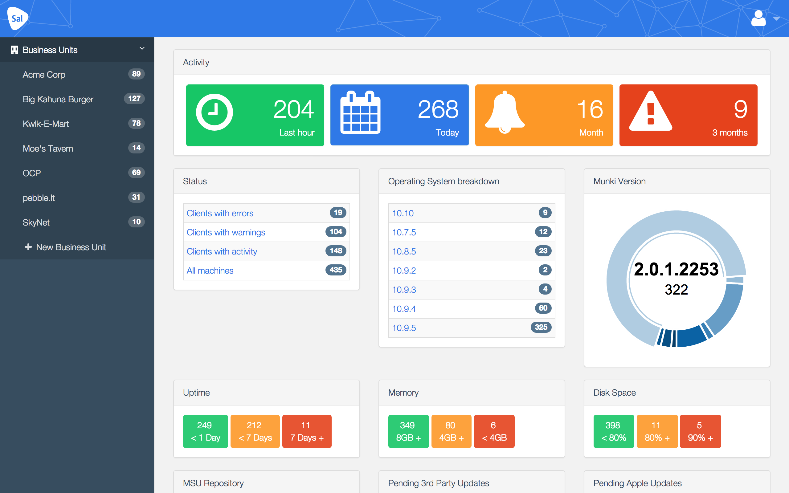

# Sal

Sal is a multi-tenanted reporting dashboard for [Munki](https://github.com/munki/munki/) with the ability to display information from [Facter](http://puppetlabs.com/facter). It has a plugin system allowing you to easily build widgets to display your custom information from Facter or Munki's [conditional items](https://github.com/munki/munki/wiki/Conditional-Items) (or both!).

With Sal, you are able to allow access to reports on certain sets of machines to certain people - for example, giving a manager access to the reports on the machines in their department. Sal has a bigger brother, Sal+. Head over to [salsoftware.com](http://salsoftware.com) to get in touch.

## Getting Started

First off, you're going to need to get the Server and then the Client component of Sal installed. [Instructions can be found here](https://github.com/salsoftware/sal/blob/master/docs/Installation.md).

Once you've got clients reporting in, you're probably going to want to customise what you see on the various screens. [Here is a full list](https://github.com/salsoftware/sal/blob/master/docs/Settings.md) of the various options that can be set in ``sal/settings.py``.

If you would like a demo of setting up Sal along with some of the features please watch the following presentation Graham made at the 2014 [Penn State MacAdmins Conference](http://youtu.be/BPTJnz27T44?t=21m28s). Slides available from [here](http://grahamgilbert.com/images/posts/2014-07-09/Multi_site_Munki.pdf).

After re-ordering and hiding plugins from some screens, you might even want to make your own plugins. You can base your plugin off of one of the included ones, or one of mine in the [repository of optional plugins](https://github.com/salsoftware/grahamgilbert-plugins). Trust me it's easy if you know python, and completely possible even if you don't. If you want more information on creating your own plugin you can follow a series of posts from my blog [part 1](http://grahamgilbert.com/blog/2014/01/26/writing-plugins-for-sal-part-1/), [part 2](http://grahamgilbert.com/blog/2014/02/07/writing-plugins-for-sal-part-2/), and [part 3](http://grahamgilbert.com/blog/2014/02/17/writing-plugins-for-sal-part-3/).

## Discussion

Discussion on the use and development of Sal is [available on the Google Group](http://groups.google.com/group/sal-discuss).

## Why Sal?

It's the Internet's fault! I asked on Twitter what I should call it, and Peter Bukowinski ([@pmbuko](https://twitter.com/pmbuko)) [suggested the name](https://twitter.com/pmbuko/status/377155523726290944), based on a Monkey puppet called [Sal Minella](http://muppet.wikia.com/wiki/Sal_Minella).

## Thank yous

First off, thanks to Greg Neagle and the rest of the Munki Project. Munki is an amazing product, and managing OS X at any scale would be miserable without it.

Thanks to Puppet Labs for basically giving away the crown jewels for nothing.
